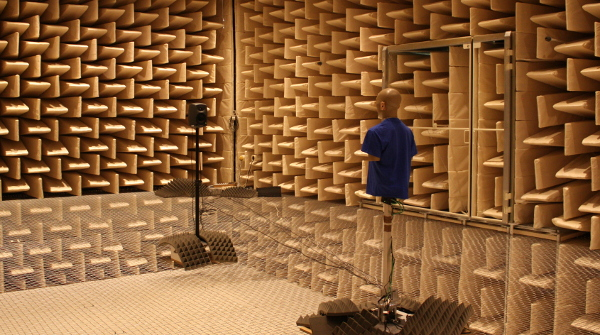
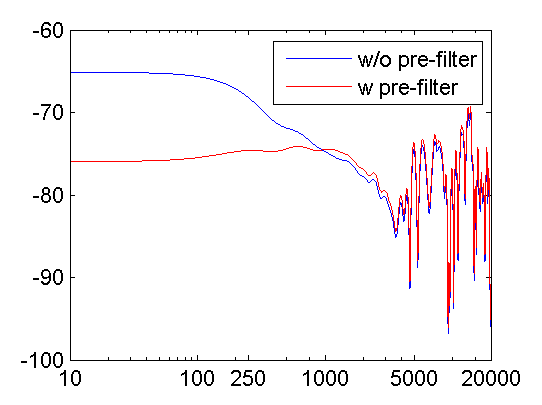
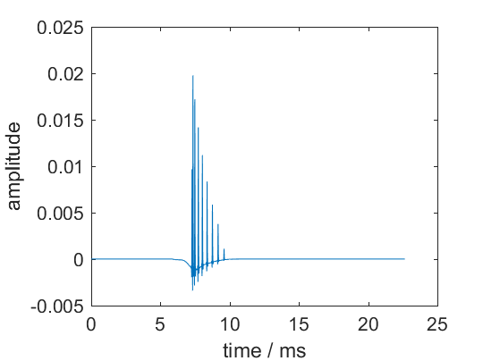
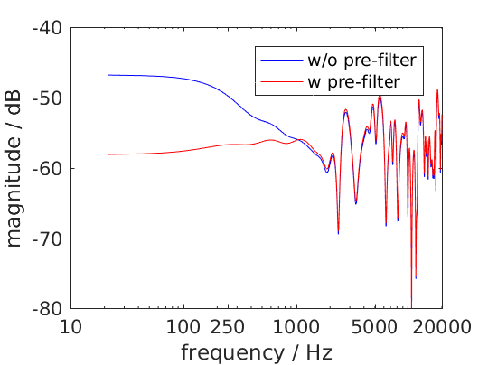
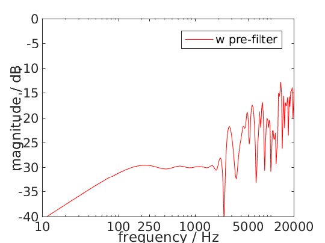

.. _sec-binaural-simulations:

Binaural Simulations
====================

If you have a set of |HRTF|\ s or |BRIR|\ s you can simulate the ear signals
reaching a listener sitting at a given point in the listening area for different
spatial audio systems.

In order to easily use different |HRTF| or |BRIR| sets the Toolbox uses the
`SOFA file format <http://sofaconventions.org>`_. In order to use it you have to
install the `SOFA API for Matlab/Octave
<https://github.com/sofacoustics/API_MO>`_ and run ``SOFAstart`` before you can
use it inside the SFS Toolbox. If you are looking for different |HRTF|\ s and
|BRIR|\ s, a large set of different impulse responses is available:
http://www.sofaconventions.org/mediawiki/index.php/Files.

The files dealing with the binaural simulations are in the folder
``SFS_binaural_synthesis``. Files dealing with |HRTF|\ s and |BRIR|\ s are in
the folder ``SFS_ir``. If you want to extrapolate your |HRTF|\ s to plane waves
you may also want to have a look in the folder ``SFS_HRTF_extrapolation``.

In the following we present some examples of binaural simulations. For their
auralization an anechoic recording of a cello is used, which can be downloaded
from `anechoic\_cello.wav
<https://dev.qu.tu-berlin.de/projects/twoears-database/repository/revisions/master/raw/stimuli/anechoic/instruments/anechoic_cello.wav>`__.

Binaural simulation of arbitrary loudspeaker arrays
---------------------------------------------------

   Setup of the |KEMAR| and a loudspeaker during a |HRTF| measurement.

If you use an |HRTF| data set, it has the advantage that it was recorded in
anechoic conditions and the only parameter that matters is the relative position
of the loudspeaker to the head during the measurement.  This advantage can be
used to create every possible loudspeaker array you can imagine, given that the
relative locations of all loudspeakers are available in the |HRTF| data set. The
above picture shows an example of a |HRTF| measurement. You can download the
corresponding `QU_KEMAR_anechoic_3m.sofa`_ |HRTF| set, which we can directly use
with the Toolbox.

.. _QU_KEMAR_anechoic_3m.sofa: https://github.com/sfstoolbox/data/raw/master/HRTFs/QU_KEMAR_anechoic_3m.sofa

The following example will load the |HRTF| data set and extracts a single
impulse response for an angle of 30° from it. If the desired angle of
30° is not available, a linear interpolation between the next two
available angles will be applied. Afterwards the impulse response will
be convolved with the cello recording by the ``auralize_ir()`` function.

.. sourcecode:: matlab

    X = [0 0 0];
    head_orientation = [0 0];
    xs = [rad(30) 0 3];
    coordinate_system = 'spherical';
    hrtf = SOFAload('QU_KEMAR_anechoic_3m.sofa');
    conf = SFS_config;
    ir = get_ir(hrtf,X,head_orientation,xs,coordinate_system,conf);
    cello = wavread('anechoic_cello.wav');
    sig = auralize_ir(ir,cello,1,conf);
    sound(sig,conf.fs);

To simulate the same source as a virtual point source synthesized by |WFS|
and a circular array with a diameter of 3 m, you have to do the
following.

.. sourcecode:: matlab

    X = [0 0 0];
    head_orientation = [pi/2 0];
    xs = [0 3 0];
    src = 'ps';
    hrtf = SOFAload('QU_KEMAR_anechoic_3m.sofa');
    conf = SFS_config;
    conf.secondary_sources.size = 3;
    conf.secondary_sources.number = 56;
    conf.secondary_sources.geometry = 'circle';
    conf.dimension = '2.5D';
    ir = ir_wfs(X,head_orientation,xs,src,hrtf,conf);
    cello = wavread('anechoic_cello.wav');
    sig = auralize_ir(ir,cello,1,conf);

If you want to use binaural simulations in listening experiments, you should not
only have the |HRTF| data set, but also a corresponding headphone compensation
filter, which was recorded with the same dummy head as the |HRTF|\ s and the
headphones you are going to use in your test.  For the |HRTF|\ s we used in the
last example and the AKG K601 headphones you can download
`QU_KEMAR_AKGK601_hcomp.wav`_.  If you want to redo the last simulation with
headphone compensation, just add the following lines before calling
``ir_wfs()``.

.. _QU_KEMAR_AKGK601_hcomp.wav: https://raw.githubusercontent.com/sfstoolbox/data/master/headphone_compensation/QU_KEMAR_AKGK601_hcomp.wav

.. sourcecode:: matlab

    conf.ir.usehcomp = true;
    conf.ir.hcompfile = 'QU_KEMAR_AKGK601_hcomp.wav';
    conf.N = 4096;

The last setting ensures that your impulse response will be long enough
for convolution with the compensation filter.

Binaural simulation of a real setup
-----------------------------------

.. figure:: img/university_rostock_loudspeaker_array.jpg
   :align: center

   Boxed shaped loudspeaker array at the University Rostock.

Besides simulating arbitrary loudspeaker configurations in an anechoic space,
you can also do binaural simulations of real loudspeaker setups.  In the
following example we use |BRIR|\ s from the 64-channel loudspeaker array of the
University Rostock as shown in the panorama photo above.  The |BRIR|\ s and
additional information on the recordings are available for download, see
`doi:10.14279/depositonce-87.2`_.  For such a measurement the |SOFA| file format
has the advantage to be able to include all loudspeakers and head orientations
in just one file.

.. _doi:10.14279/depositonce-87.2: http://dx.doi.org/10.14279/depositonce-87.2

.. sourcecode:: matlab

    X = [0 0 0];
    head_orientation = [0 0];
    xs = [3 0 0];
    src = 'ps';
    brir = 'BRIR_AllAbsorbers_ArrayCentre_Emitters1to64.sofa';
    conf = SFS_config;
    conf.secondary_sources.geometry = 'custom';
    conf.secondary_sources.x0 = brir;
    conf.N = 44100;
    ir = ir_wfs(X,head_orientation,xs,src,brir,conf);
    cello = wavread('anechoic_cello.wav');
    sig = auralize_ir(ir,cello,1,conf);

In this case, we don't load the |BRIR|\ s into the memory with
``SOFAload()`` as the file is too large. Instead, we make use of the
ability that |SOFA| can request single impulse responses from the file by
just passing the file name to the ``ir_wfs()`` function. In addition, we
have to set ``conf.N`` to a reasonable large value as this determines
the length of the impulse response ``ir_wfs()`` will return, which has
to be larger as for the anechoic case as it should now include the room
reflections. Note, that the head orientation is chosen to be ``0``
instead of ``pi/2`` as in the |HRTF| examples due to a difference in the
orientation of the coordinate system of the |BRIR| measurement.

Impulse response of your spatial audio system
---------------------------------------------

Binaural simulations are also an interesting approach to investigate the
behavior of a given spatial audio system at different listener positions. Here, we
are mainly interested in the influence of the system and not the |HRTF|\ s so we
simply use a Dirac impulse as |HRTF| as provided by ``dummy_irs()``.

.. sourcecode:: matlab

    X = [0 0 0];
    head_orientation = [0 0];
    xs = [2.5 0 0];
    src = 'ps';
    t = (1:1000)/conf.fs*1000;
    hrtf = dummy_irs(conf);
    conf = SFS_config;
    conf.t0 = 'source';
    [ir,~,delay] = ir_wfs(X,head_orientation,xs,src,hrtf,conf);
    figure;
    figsize(540,404,'px');
    plot(t,ir(1:1000,1),'-g');
    hold on;
    offset = round(delay*conf.fs);
    plot(t,ir(1+offset:1000+offset,1),'-b');
    hold off;
    xlabel('time / ms');
    ylabel('amplitude');
    %print_png('img/impulse_response_wfs_25d.png');

   Sound pressure of an impulse synthesized as a point source by 2.5D |WFS| at
   (2.5, 0, 0) m. The sound pressure is observed by a virtual microphone at (0,
   0, 0) m. The impulse is plotted including the delay offset of the WFS driving
   function (green) and with a corrected delay that corresponds to the source
   poisition (blue).

The figure includes two versions of the impulse response at two different time
instances. The green impulse response includes the processing delay that is
added by ``driving_function_imp_wfs()`` and other functions performing filtering
and delaying of signals. This delay is returned by ``ir_wfs()`` as well and can
be used to correct it during plotting. The blue impulse response is the
corrected one, which is now placed at 7.3 ms which corresponds to the actual
distance of the synthesized source of 2.5 m.

The impulse response can also be calculated without involving functions for
binaural simulations, but by utilizing directly ``sound_field_imp()`` related
function.

.. sourcecode:: matlab

    X = [0 0 0];
    head_orientation = [0 0];
    xs = [2.5 0 0];
    src = 'ps';
    conf = SFS_config;
    conf.N = 1000;
    conf.t0 = 'source';
    time_response_wfs(X,xs,src,conf)
    axis([0 25 -0.005 0.025]);
    %print_png('img/impulse_response_wfs_25d_imp.png');

   Sound pressure of an impulse synthesized as a point source by 2.5D
   |WFS| at (2.5, 0, 0) m. The sound pressure is observed by a virtual
   microphone at (0, 0, 0) m.

This time the delay offset of the driving function is automatically corrected
for and the involved calculation uses inherently a fractional delay filter. The
downside is that the calculation takes longer and the amplitude is slightly
lower by the involved fractional delay method.

Frequency response of your spatial audio system
-----------------------------------------------

Binaural simulations are also a nice way to investigate the frequency
response of your reproduction system. The following code will
investigate the influence of the pre-equalization filter in |WFS| on the
frequency response. For the red line the pre-filter is used and its
upper frequency is set to the expected aliasing frequency of the system
(above these frequency the spectrum becomes very noise as you can see in
the figure).

.. sourcecode:: matlab

    X = [0 0 0];
    head_orientation = [pi/2 0];
    xs = [0 2.5 0];
    src = 'ps';
    hrtf = dummy_irs(conf);
    conf = SFS_config;
    conf.ir.usehcomp = false;
    conf.wfs.usehpre = false;
    [ir1,x0] = ir_wfs(X,head_orientation,xs,src,hrtf,conf);
    conf.wfs.usehpre = true;
    conf.wfs.hprefhigh = aliasing_frequency(x0,conf);
    ir2 = ir_wfs(X,head_orientation,xs,src,hrtf,conf);
    [a1,p,f] = spectrum_from_signal(norm_signal(ir1(:,1)),conf);
    a2 = spectrum_from_signal(norm_signal(ir2(:,1)),conf);
    figure;
    figsize(540,404,'px');
    semilogx(f,20*log10(a1),'-b',f,20*log10(a2),'-r');
    axis([10 20000 -80 -40]);
    set(gca,'XTick',[10 100 250 1000 5000 20000]);
    legend('w/o pre-filter','w pre-filter');
    xlabel('frequency / Hz');
    ylabel('magnitude / dB');
    %print_png('img/frequency_response_wfs_25d.png');

   Sound pressure in decibel of a point source synthesized by 2.5D |WFS| for
   different frequencies. The 2.5D |WFS| is performed with and without the
   pre-equalization filter. The calculation is performed in the time domain.

The same can be done in the frequency domain, but in this case we are
not able to set a maximum frequency of the pre-equalization filter and
the whole frequency range will be affected.

.. sourcecode:: matlab

    X = [0 0 0];
    xs = [0 2.5 0];
    src = 'ps';
    conf = SFS_config;
    freq_response_wfs(X,xs,src,conf);
    axis([10 20000 -40 0]);
    %print_png('img/frequency_response_wfs_25d_mono.png');

   Sound pressure in decibel of a point source synthesized by 2.5D |WFS| for
   different frequencies. The 2.5D |WFS| is performed only with the
   pre-equalization filter active at all frequencies. The calculation is
   performed in the frequency domain.

Using the SoundScape Renderer with the SFS Toolbox
--------------------------------------------------

In addition to binaural synthesis, you may want to apply dynamic binaural
synthesis, which means you track the position of the head of the listener and
switches the used impulse responses regarding the head position. The `SoundScape
Renderer (SSR)`_ is able to do this. The SFS Toolbox provides functions to
generate the needed wav files containing the impulse responses used by the
SoundScape Renderer. All functions regarding the |SSR| are stored in folder
``SFS_ssr``.

.. sourcecode:: matlab

    X = [0 0 0];
    head_orientation = [pi/2 0];
    xs = [0 2.5 0];
    src = 'ps';
    hrtf = SOFAload('QU_KEMAR_anechoic_3m.sofa');
    conf = SFS_config;
    brs = ssr_brs_wfs(X,head_orientation,xs,src,hrtf,conf);
    wavwrite(brs,conf.fs,16,'brs_set_for_SSR.wav');

.. _SoundScape Renderer (SSR): http://spatialaudio.net/ssr/

.. vim: filetype=rst spell:
