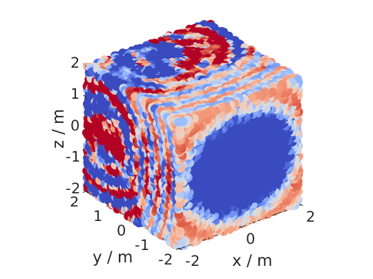
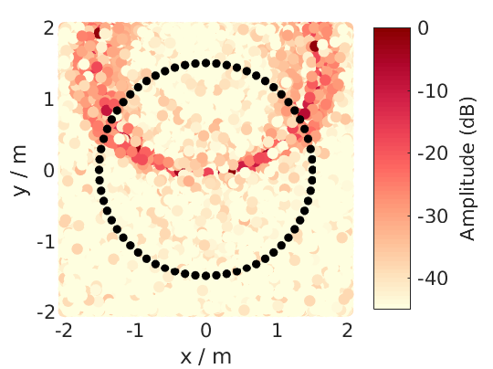

.. _sec-custom-grid:

Custom Grids
============

As stated earlier you can provide the sound field simulation functions a
custom grid instead of the ``[min max]`` ranges. Again, you can provide
it for one dimension, two dimensions, or all three dimensions.

.. sourcecode:: matlab

    conf = SFS_config;
    conf.dimension = '3D';
    conf.secondary_sources.number = 225;
    conf.secondary_sources.geometry = 'sphere';
    conf.resolution = 100;
    conf.plot.normalisation = 'center';
    X = randi([-2000 2000],125000,1)/1000;
    Y = randi([-2000 2000],125000,1)/1000;
    Z = randi([-2000 2000],125000,1)/1000;
    sound_field_mono_wfs(X,Y,Z,[0 -1 0],'pw',800,conf);
    %print_png('img/sound_field_wfs_3d_xyz_custom_grid.png');
    conf.plot.usedb = true;
    conf.dimension = '2.5D';
    conf.secondary_sources.number = 64;
    conf.secondary_sources.geometry = 'circle';
    sound_field_imp_nfchoa(X,Y,0,[0 2 0],'ps',0.005,conf);
    %print_png('img/sound_field_imp_nfchoa_25d_dB_custom_grid.png');

   Sound pressure of a monochromatic point source synthesized by 3D |WFS|. The
   plane wave has a frequency of 800 Hz and is travelling into the direction
   (0,-1,0). The sound pressure is calculated only at the explicitly provided
   grid points.

   Sound pressure in decibel of a broadband impulse point source synthesized by
   2.5D |NFC-HOA|. The point source is placed at (0,2,0) m and a time snapshot
   after 5 ms of the first active secondary source is shown. The sound pressure
   is calculated only at the explicitly provided grid points.

.. vim: filetype=rst spell:
