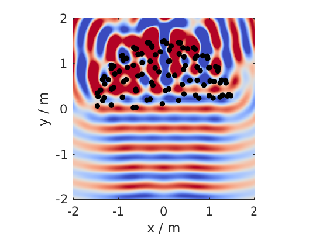
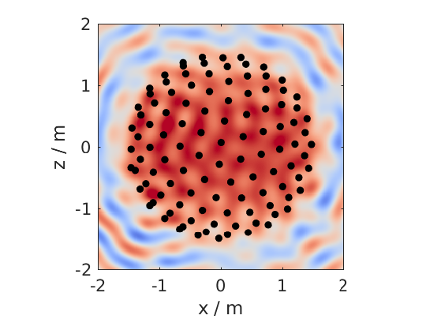
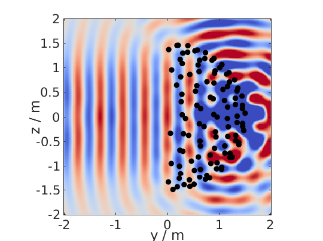
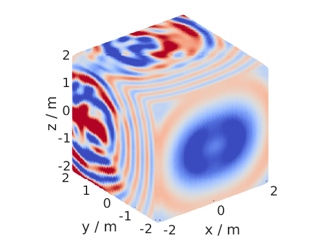
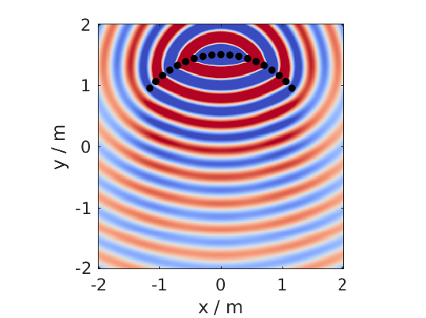
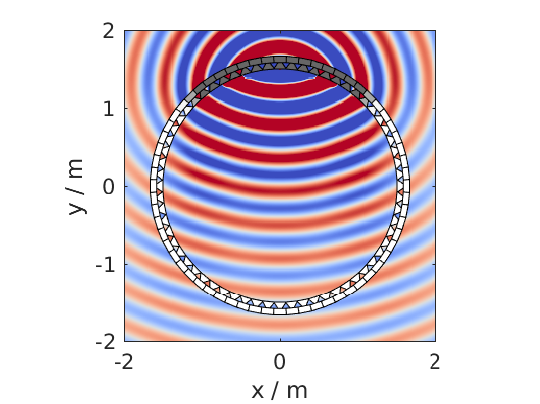
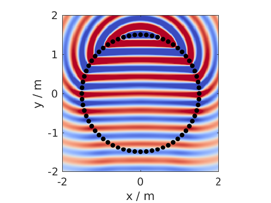
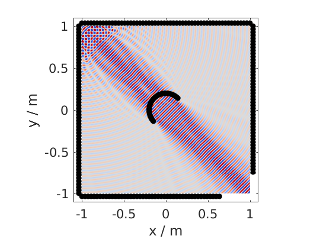
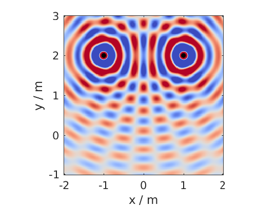

.. _sec-frequency-domain:

Frequency Domain
================

With the files in the folder ``SFS_monochromatic`` you can simulate a
monochromatic sound field in a specified area for different techniques like
|WFS| and |NFC-HOA|. The area can be a 3D cube, a 2D plane, a line or only one
point. This depends on the specification of ``X,Y,Z``. For example ``[-2 2],[-2
2],[-2 2]`` will be a 3D cube; ``[-2 2],0,[-2 2]`` the xz-plane; ``[-2 2],0,0``
a line along the x-axis; ``3,2,1`` a single point. If you present a range like
``[-2 2]`` the Toolbox will create automatically a regular grid from this
ranging from -2 to 2 with ``conf.resolution`` steps in between. Alternatively
you could apply a :ref:`custom grid <sec-custom-grid>` by providing a matrix
instead of the ``[min max]`` range for all active axes.

For all 2.5D functions the configuration ``conf.xref`` is important as it
defines the point for which the amplitude is corrected in the sound
field. The default entry is

.. sourcecode:: matlab

    conf.xref = [0 0 0];

Wave Field Synthesis
--------------------

The following will simulate the field of a virtual plane wave with a
frequency of 800 Hz going into the direction of (0 -1 0) synthesized
with 3D |WFS|.

.. sourcecode:: matlab

    conf = SFS_config;
    conf.dimension = '3D';
    conf.secondary_sources.size = 3;
    conf.secondary_sources.number = 225;
    conf.secondary_sources.geometry = 'sphere';
    % [P,x,y,z,x0,win] = sound_field_mono_wfs(X,Y,Z,xs,src,f,conf);
    sound_field_mono_wfs([-2 2],[-2 2],0,[0 -1 0],'pw',800,conf);
    %print_png('img/sound_field_wfs_3d_xy.png');
    sound_field_mono_wfs([-2 2],0,[-2 2],[0 -1 0],'pw',800,conf);
    %print_png('img/sound_field_wfs_3d_xz.png');
    sound_field_mono_wfs(0,[-2 2],[-2 2],[0 -1 0],'pw',800,conf);
    %print_png('img/sound_field_wfs_3d_yz.png');

   Sound pressure of a mono-chromatic plane wave synthesized by 3D |WFS|. The
   plane wave has a frequency of 800Hz and is travelling into the direction
   (0,-1,0). The plot shows the xy-plane.

   The same as in the figure before, but now showing the xz-plane.

   The same as in the figure before, but now showing the yz-plane.

You can see that the Toolbox is now projecting all the secondary source
positions into the plane for plotting them. In addition the axis are
automatically chosen and labeled.

It is also possible to simulate and plot the whole 3D cube, but in this
case no secondary sources will be added to the plot.

.. sourcecode:: matlab

    conf = SFS_config;
    conf.dimension = '3D';
    conf.secondary_sources.size = 3;
    conf.secondary_sources.number = 225;
    conf.secondary_sources.geometry = 'sphere';
    conf.resolution = 100;
    sound_field_mono_wfs([-2 2],[-2 2],[-2 2],[0 -1 0],'pw',800,conf);
    %print_png('img/sound_field_wfs_3d_xyz.png');

   Sound pressure of a mono-chromatic plane wave synthesized by 3D |WFS|. The
   plane wave has a frequency of 800Hz and is travelling into the direction
   (0,-1,0). All three dimensions are shown.

In the next plot we use a two dimensional array, 2.5D |WFS| and a virtual
point source located at (0 2.5 0) m. The 3D example showed you, that the
sound fields are automatically plotted if we specify now output
arguments. If we specify one, we have to explicitly say if we want also
plot the results, by ``conf.plot.useplot = true;``.

.. sourcecode:: matlab

    conf = SFS_config;
    conf.dimension = '2.5D';
    conf.plot.useplot = true;
    conf.plot.normalisation = 'center';
    % [P,x,y,z,x0] = sound_field_mono_wfs(X,Y,Z,xs,src,f,conf);
    [P,x,y,z,x0] = sound_field_mono_wfs([-2 2],[-2 2],0,[0 2.5 0],'ps',800,conf);
    %print_png('img/sound_field_wfs_25d.png');

   Sound pressure of a mono-chromatic point source synthesized by 2.5D |WFS|. The
   point source has a frequency of 800Hz and is placed at (0 2.5 0)m. Only the
   active loudspeakers of the array are plotted.

If you want to plot the whole loudspeaker array and not only the active
secondary sources, you can do this by adding these commands. First we
store all sources in an extra variable ``x0_all``, then we get the active
ones ``x0`` and the corresponding indices of these active ones in ``x0_all``.
Afterwards we set all sources in ``x0_all`` to zero, which are inactive and
only the active ones to the loudspeaker weights ``x0(:,7)``.

.. sourcecode:: matlab

    x0_all = secondary_source_positions(conf);
    [~,idx] = secondary_source_selection(x0_all,[0 2.5 0],'ps');
    x0_all(:,7) = zeros(1,size(x0_all,1));
    x0_all(idx,7) = x0(:,7);
    plot_sound_field(P,[-2 2],[-2 2],0,x0_all,conf);
    %print_png('img/sound_field_wfs_25d_with_all_sources.png');

   Sound pressure of a mono-chromatic point source synthesized by 2.5D |WFS|. The
   point source has a frequency of 800Hz and is placed at (0 2.5 0)m. All
   loudspeakers are plotted. Their color correspond to the loudspeaker weights,
   where white stands for zero.

Near-Field Compensated Higher Order Ambisonics
----------------------------------------------

In the following we will simulate the field of a virtual plane wave with
a frequency of 800 Hz traveling into the direction (0 -1 0), synthesized
with 2.5D |NFC-HOA|.

.. sourcecode:: matlab

    conf = SFS_config;
    conf.dimension = '2.5D';
    % sound_field_mono_nfchoa(X,Y,Z,xs,src,f,conf);
    sound_field_mono_nfchoa([-2 2],[-2 2],0,[0 -1 0],'pw',800,conf);
    %print_png('img/sound_field_nfchoa_25d.png');

   Sound pressure of a monochromatic plane wave synthesized by 2.5D |NFC-HOA|. The
   plane wave has a frequency of 800 Hz and is traveling into the direction
   (0,-1,0).

Local Wave Field Synthesis
--------------------------

In |NFC-HOA| the aliasing frequency in a small region inside the listening
area can be increased by limiting the used order. A similar outcome can
be achieved in |WFS| by applying so called local Wave Field Synthesis. In
this case the original loudspeaker array is driven by |WFS| to create a
virtual loudspeaker array consisting of focused sources which can then
be used to create the desired sound field in a small area. The settings
are the same as for |WFS|, but a new struct ``conf.localwfs`` has to be filled
out, which for example provides the settings for the desired position
and form of the local region with higher aliasing frequency, have a look
into ``SFS_config.m`` for all possible settings.

.. sourcecode:: matlab

    X = [-1 1];
    Y = [-1 1];
    Z = 0;
    xs = [1 -1 0];
    src = 'pw';
    f = 7000;
    conf = SFS_config;
    conf.resolution = 1000;
    conf.dimension = '2D';
    conf.secondary_sources.geometry = 'box';
    conf.secondary_sources.number = 4*56;
    conf.secondary_sources.size = 2;
    conf.localwfs_vss.size = 0.4;
    conf.localwfs_vss.center = [0 0 0];
    conf.localwfs_vss.geometry = 'circular';
    conf.localwfs_vss.number = 56;
    sound_field_mono_localwfs_vss(X,Y,Z,xs,src,f,conf);
    axis([-1.1 1.1 -1.1 1.1]);
    %print_png('img/sound_field_localwfs_2d.png');

   Sound pressure of a monochromatic plane wave synthesized by 2D local |WFS|. The
   plane wave has a frequency of 7000 Hz and is traveling into the direction
   (1,-1,0). The local |WFS| is created by using focused sources to create a
   virtual circular loudspeaker array in he center of the actual loudspeaker
   array.

Stereo
------

The Toolbox includes not only |WFS| and |NFC-HOA|, but also some generic
sound field functions that are doing only the integration of the driving
signals of the single secondary sources to the resulting sound field.
With these function you can for example easily simulate a stereophonic
setup. In this example we set the
``conf.plot.normalisation = 'center';`` configuration manually as the
amplitude of the sound field is too low for the default ``'auto'``
setting to work.

.. sourcecode:: matlab

    conf = SFS_config;
    conf.plot.normalisation = 'center';
    x0 = [-1 2 0 0 -1 0 1;1 2 0 0 -1 0 1];
    % [P,x,y,z] = sound_field_mono(X,Y,Z,x0,src,D,f,conf)
    sound_field_mono([-2 2],[-1 3],0,x0,'ps',[1 1],800,conf)
    %print_png('img/sound_field_stereo.png');

   Sound pressure of a monochromatic phantom source generated by stereophony.
   The phantom source has a frequency of 800 Hz and is placed at (0,2,0) by
   amplitude panning.

.. vim: filetype=rst spell:
