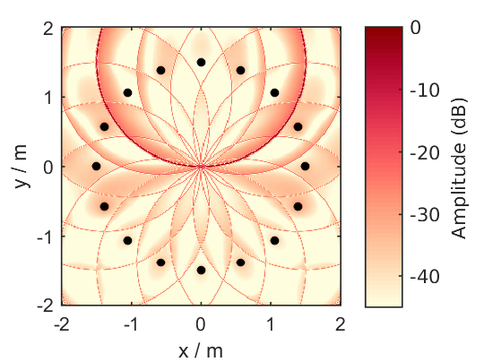
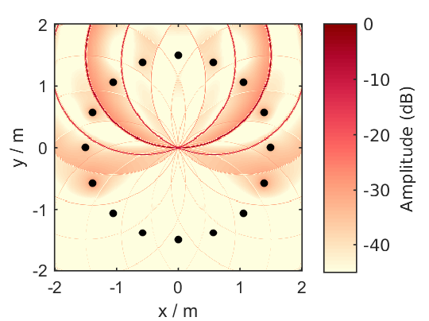
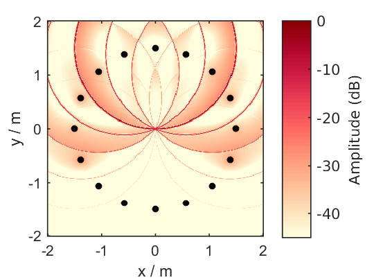

.. _sec-modal-window:

Modal Windows
=============

In the time-domain implementation of |NFC-HOA| it is possible to apply
different weighting factors to each mode of the driving signals in the circular
harmonics domain by changing the ``conf.modal_window`` configuration parameter.
Using a weighting window that is smoother than the default rectangular window,
causes a concentration of energy to fewer loudspeakers.

.. sourcecode:: matlab

    conf = SFS_config;
    conf.dimension = '2.5D';
    conf.secondary_sources.number = 16;
    conf.secondary_sources.geometry = 'circular';
    conf.secondary_sources.size = 3;
    conf.resolution = 300;
    conf.plot.usedb = true;
    conf.t0 = 'source';
    X = [-2,2];
    Y = [-2,2];
    Z = 0;
    conf.modal_window = 'rect';  % default
    sound_field_imp_nfchoa(X,Y,Z,[0 -1 0],'pw',0,conf);
    %print_png('sound_field_imp_nfchoa_25d_dB_rect.png');
    conf.modal_window = 'max-rE';
    sound_field_imp_nfchoa(X,Y,Z,[0 -1 0],'pw',0,conf);
    %print_png('sound_field_imp_nfchoa_25d_dB_max-rE.png');
    conf.modal_window = 'kaiser';
    conf.modal_window_parameter = 1.0;
    sound_field_imp_nfchoa(X,Y,Z,[0 -1 0],'pw',0,conf);
    %print_png('sound_field_imp_nfchoa_25d_dB_kaiser.png');
    conf.modal_window = 'tukey';
    conf.modal_window_parameter = 0.5;
    sound_field_imp_nfchoa(X,Y,Z,[0 -1 0],'pw',0,conf);
    %print_png('sound_field_imp_nfchoa_25d_dB_tukey.png');

   Sound pressure in decibel of a broadband impulse plane wave synthesized by
   2.5D |NFC-HOA| using a rectangular window. The plane wave propagates
   into the direction of (0,-1,0).

   Sound pressure in decibel of a broadband impulse plane wave synthesized by
   2.5D |NFC-HOA| using a max-rE window. The plane wave propagates into the
   direction of (0,-1,0).

   Sound pressure in decibel of a broadband impulse plane wave synthesized by
   2.5D |NFC-HOA| using a Kaiser window. The plane wave propagates into the
   direction of (0,-1,0).

   Sound pressure in decibel of a broadband impulse plane wave synthesized by
   2.5D |NFC-HOA| using a modified Tukey window. The plane wave propagates into
   the direction of (0,-1,0).

.. vim: filetype=rst spell:
