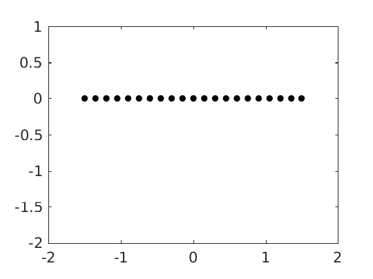
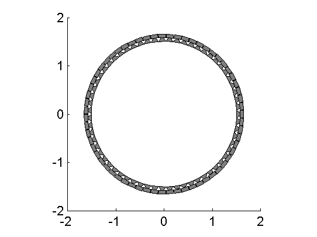
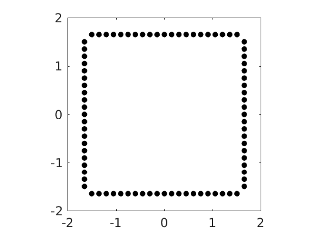
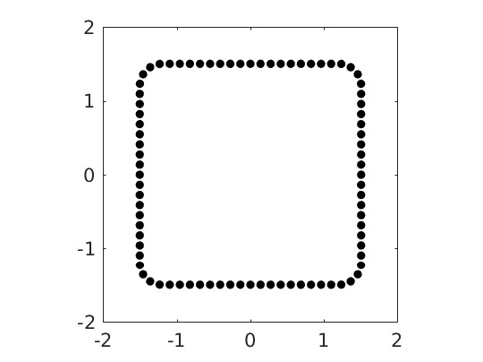
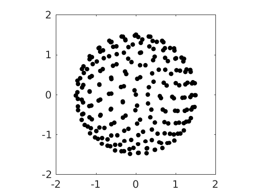
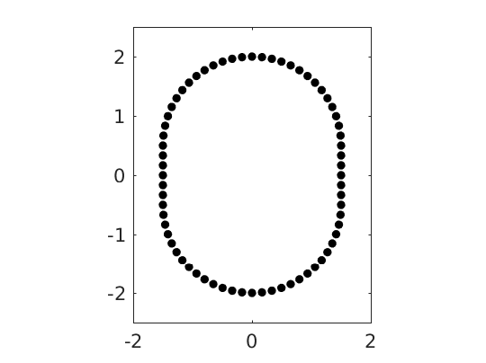
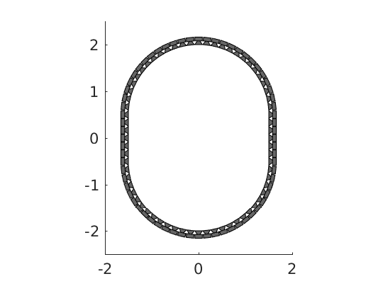

.. _sec-secondary-sources:

Secondary Sources
=================

The Toolbox comes with a function which can generate different common
shapes of loudspeaker arrays for you. At the moment linear, circular,
box shaped and spherical arrays are supported.

Before showing the different geometries, we start with some common
settings. First we get a configuration struct and set the array
size/diameter to 3 m.

.. sourcecode:: matlab

    conf = SFS_config;
    conf.secondary_sources.size = 3;

Linear array
------------

.. sourcecode:: matlab

    conf = SFS_config;
    conf.secondary_sources.geometry = 'line'; % or 'linear'
    conf.secondary_sources.number = 21;
    x0 = secondary_source_positions(conf);
    figure;
    figsize(conf.plot.size(1),conf.plot.size(2),conf.plot.size_unit);
    draw_loudspeakers(x0,conf);
    axis([-2 2 -2 1]);
    %print_png('img/secondary_sources_linear.png');

   Linear loudspeaker array with a length of 3m consiting of 21 loudspeakers.

Circular array
--------------

.. sourcecode:: matlab

    conf = SFS_config;
    conf.secondary_sources.geometry = 'circle'; % or 'circular'
    conf.secondary_sources.number = 56;
    x0 = secondary_source_positions(conf);
    figure;
    figsize(540,404,'px');
    draw_loudspeakers(x0,conf);
    axis([-2 2 -2 2]);
    %print_png('img/secondary_sources_circle.png');

   Circular loudspeaker array with a diameter of 3m consiting of 56
   loudspeakers.

Box shaped array
----------------

.. sourcecode:: matlab

    conf = SFS_config;
    conf.secondary_sources.geometry = 'box';
    conf.secondary_sources.number = 84;
    x0 = secondary_source_positions(conf);
    figure;
    figsize(540,404,'px');
    draw_loudspeakers(x0,conf);
    axis([-2 2 -2 2]);
    %print_png('img/secondary_sources_box.png');

   Box shaped loudspeaker array with a diameter of 3m consisting of 84
   loudspeakers.

Box shaped array with rounded edges
-----------------------------------

``conf.secondary_sources.edge_radius`` defines the bending radius of the
corners. It can be chosen in a range between ``0.0`` and the half of
``conf.secondary_sources.size``. While the prior represents a square box
the latter yields a circle. Note that the square box behaves it little
bit different than the Box Shaped Array since loudspeakers might also be
place directly in the corners of the box.

.. sourcecode:: matlab

    conf = SFS_config;
    conf.secondary_sources.geometry = 'rounded-box';
    conf.secondary_sources.number = 84;
    conf.secondary_sources.corner_radius = 0.3;
    x0 = secondary_source_positions(conf);
    figure;
    figsize(540,404,'px');
    draw_loudspeakers(x0,conf);
    axis([-2 2 -2 2]);
    %print_png('img/secondary_sources_rounded-box.png');

   Box shaped loudspeaker array with rounded edges. It has again a diameter of
   3m, consists of 84 loudspeakers and has a edge bending factor of 0.3.

Spherical array
---------------

For a spherical array you need a grid to place the secondary sources on the
sphere. At the moment we provide grids with the Toolbox, that can be found in
the `corresponding folder of the data repository`_.  You have to specify your
desired grid, for example ``conf.secondary_sources.grid =
'equally_spaced_points'``. The ``secondary_source_positions()`` functions will
then automatically download the desired grid from that web page and stores it
under ``<$SFS_MAIN_PATH>/data``. If the download is not working (which can
happen especially under Matlab and Windows) you can alternatively checkout or
download the whole `data repository`_ to the data folder.

.. _corresponding folder of the data repository: http://github.com/sfstoolbox/data/tree/master/spherical_grids
.. _data repository: http://github.com/sfstoolbox/data

.. sourcecode:: matlab

    conf = SFS_config;
    conf.secondary_sources.size = 3;
    conf.secondary_sources.geometry = 'sphere'; % or 'spherical'
    conf.secondary_sources.grid = 'equally_spaced_points';
    conf.secondary_sources.number = 225;
    x0 = secondary_source_positions(conf);
    figure;
    figsize(540,404,'px');
    draw_loudspeakers(x0,conf);
    axis([-2 2 -2 2]);
    %print_png('img/secondary_sources_sphere.png');

   Spherical loudspeaker array with a diameter of 3m consiting of 225
   loudspeakers arranged on a grid with equally spaced points.

Arbitrary shaped arrays
-----------------------

You can create arbitrarily shaped arrays by setting
``conf.secondary_sources.geometry`` to ``'custom'`` and define the values of the
single loudspeaker directly in the ``conf.secondary_sources.x0`` matrix. The
rows of the matrix contain the single loudspeakers and the six columns are ``[x
y z nx ny nz w]``, the position and direction and weight of the single
loudspeakers. The weight ``w`` is a factor the driving function of this
particular loudspeaker is multiplied with in a function that calculates the
sound field from the given driving signals and secondary sources. For |WFS|
``w`` could include the tapering window, a spherical grid weight, and the
:math:`r^2 \cos(\theta)` weights for integration on a sphere.

.. sourcecode:: matlab

    conf = SFS_config;
    % create a stadium like shape by combining two half circles with two linear
    % arrays
    % first getting a full circle with 56 loudspeakers
    conf.secondary_sources.geometry = 'circle';
    conf.secondary_sources.number = 56;
    conf.secondary_sources.x0 = [];
    x0 = secondary_source_positions(conf);
    % store the first half cricle and move it up
    x01 = x0(2:28,:);
    x01(:,2) = x01(:,2) + ones(size(x01,1),1)*0.5;
    % store the second half circle and move it down
    x03 = x0(30:56,:);
    x03(:,2) = x03(:,2) - ones(size(x03,1),1)*0.5;
    % create a linear array
    conf.secondary_sources.geometry = 'line';
    conf.secondary_sources.number = 7;
    conf.secondary_sources.size = 1;
    x0 = secondary_source_positions(conf);
    % rotate it and move it left
    R = rotation_matrix(pi/2);
    x02 = [(R*x0(:,1:3)')' (R*x0(:,4:6)')'];
    x02(:,1) = x02(:,1) - ones(size(x0,1),1)*1.5;
    x02(:,7) = x0(:,7);
    % rotate it the other way around and move it right
    R = rotation_matrix(-pi/2);
    x04 = [(R*x0(:,1:3)')' (R*x0(:,4:6)')'];
    x04(:,1) = x04(:,1) + ones(size(x0,1),1)*1.5;
    x04(:,7) = x0(:,7);
    % combine everything
    conf.secondary_sources.geometry = 'custom';
    conf.secondary_sources.x0 = [x01; x02; x03; x04];
    % if we gave the conf.x0 to the secondary_source_positions function it will
    % simply return the defined x0 matrix
    x0 = secondary_source_positions(conf);
    figure;
    figsize(540,404,'px');
    draw_loudspeakers(x0,conf);
    axis([-2 2 -2.5 2.5]);
    %print_png('img/secondary_sources_arbitrary.png');

   Custom arena shaped loudspeaker array consiting of 70 loudspeakers.

Plot loudspeaker symbols
------------------------

For two dimensional setups you can plot the secondary sources with
loudspeaker symbols, for example the following will replot the last
array.

.. sourcecode:: matlab

    conf.plot.realloudspeakers = true;
    figure;
    figsize(540,404,'px');
    draw_loudspeakers(x0,conf);
    axis([-2 2 -2.5 2.5]);
    %print_png('img/secondary_sources_arbitrary_realloudspeakers.png');

   Custom arena shaped loudspeaker array consiting of 70 loudspeakers, plotted
   using loudspeaker symbols instead of circles for the single loudspeakers.

.. vim: filetype=rst spell:
