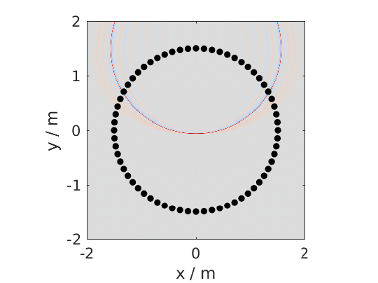
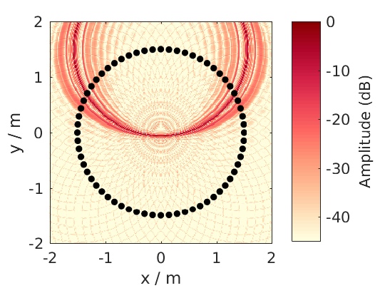
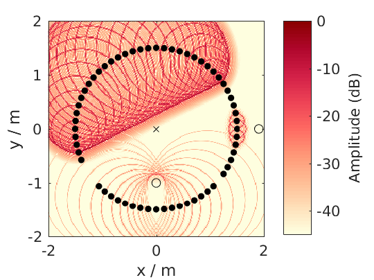

.. _sec-time-domain:

Time Domain
===========

With the files in the folder ``SFS_time_domain`` you can simulate snapshots in time
of an impulse originating from your |WFS| or |NFC-HOA| system.

In the following we will create a snapshot in time after 5 ms for
a broadband virtual point source placed at (0 2 0) m for 2.5D |NFC-HOA|.

.. sourcecode:: matlab

    conf = SFS_config;
    conf.dimension = '2.5D';
    conf.plot.useplot = true;
    % sound_field_imp_nfchoa(X,Y,Z,xs,src,t,conf)
    [p,x,y,z,x0] = sound_field_imp_nfchoa([-2 2],[-2 2],0,[0 2 0],'ps',0.005,conf);
    %print_png('img/sound_field_imp_nfchoa_25d.png');

   Sound pressure of a broadband impulse point source synthesized by 2.5D
   |NFC-HOA|. The point source is placed at (0,2,0) m and the time snapshot is
   shown 5 ms after the first secondary source was active.

The output can also be plotted in dB by setting ``conf.plot.usedb = true;``.
In this case the default color map is changed and a color bar is plotted
in the figure. For none dB plots no color bar is shown in the plots. In
these cases the color coding goes always from -1 to 1, with clipping of
larger values.

.. sourcecode:: matlab

    conf.plot.usedb = true;
    plot_sound_field(p,[-2 2],[-2 2],0,x0,conf);
    %print_png('img/sound_field_imp_nfchoa_25d_dB.png');

   Sound pressure in decibel of the same broadband impulse point source as in
   the figure above.

You could change the color map yourself doing the following before the
plot command.

.. sourcecode:: matlab

    conf.plot.colormap = 'jet'; % Matlab rainbow color map

If you want to simulate more than one virtual source, it is a good idea
to set the starting time of your simulation to start with the activity
of your virtual source and not with the secondary sources, which is the
default behavior. You can change this by setting
``conf.t0 = 'source'``.

.. sourcecode:: matlab

    conf.plot.useplot = false;
    conf.t0 = 'source';
    t_40cm = 0.4/conf.c; % time to travel 40 cm in s
    t0 = 0.0005; % start time of focused source in s
    [p_ps,~,~,~,x0_ps] = ...
        sound_field_imp_wfs([-2 2],[-2 2],0,[1.9 0 0],'ps',t0+t_40cm,conf);
    [p_pw,~,~,~,x0_pw] = ...
        sound_field_imp_wfs([-2 2],[-2 2],0,[1 -2 0],'pw',t0-t_40cm,conf);
    [p_fs,~,~,~,x0_fs] = ...
        sound_field_imp_wfs([-2 2],[-2 2],0,[0 -1 0 0 1 0],'fs',t0,conf);
    plot_sound_field(p_ps+p_pw+p_fs,[-2 2],[-2 2],0,[x0_ps; x0_pw; x0_fs],conf)
    hold;
    scatter(0,0,'kx');   % origin of plane wave
    scatter(1.9,0,'ko'); % point source
    scatter(0,-1,'ko');  % focused source
    hold off;
    %print_png('sound_field_imp_multiple_sources_dB.png');

   Sound pressure in decibel of a boradband impulse plane wave, point source,
   and focused source synthesized all by 2.5D |WFS|. The plane wave is traveling
   into the direction (1,-2,0) and shown 0.7 ms before it starting point at
   (0,0,0). The point source is placed at (1.9,0,0) m and shown 1.7 ms after its
   start. The focused source is placed at (0,-1,0) m and shown 0.5 ms after its
   start.

.. vim: filetype=rst spell:
